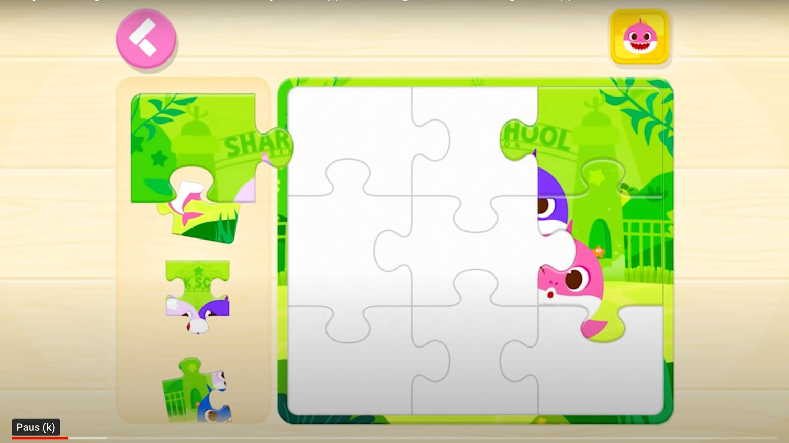

# Template Game

## Ideas

- Create Flow by Sequencing Games
- Use Video Animations as Rewards

## Games

### Puzzle

### Find The Difference

### Hidden Object

## Comparison

- Efficiency: ✅ (Highest) to 🍁 (Lowest)
- Replay Value: ✅ (Highest) to 🍁 (Lowest)
- Effort New Content: ✅ (Lowest) to 🍁 (Highest)

| Game                          | Screen Efficiency | Replay Value | Effort New Content |
|-------------------------------|:-----------------:|:------------:|:------------------:|
| Puzzle (1x Image)             |        👍         |      ✅       |         ✅          |
| Puzzle (1x Video)             |        👍         |      ✅       |         👍         |
| Difference (2x Image)         |        🍁         |      👍      |         👍         |
| Difference (1x Img, 1x Video) |        🍁         |      👍      |         🍁         |
| Hidden Obj (Images)           |         ✅         |      👍      |         👍         |
| Hidden Obj (Images + 1 Video) |         ✅         |      👍      |         🍁         |
| Hidden Obj (Images + Videos)  |         ✅         |      👍      |         🍁         |